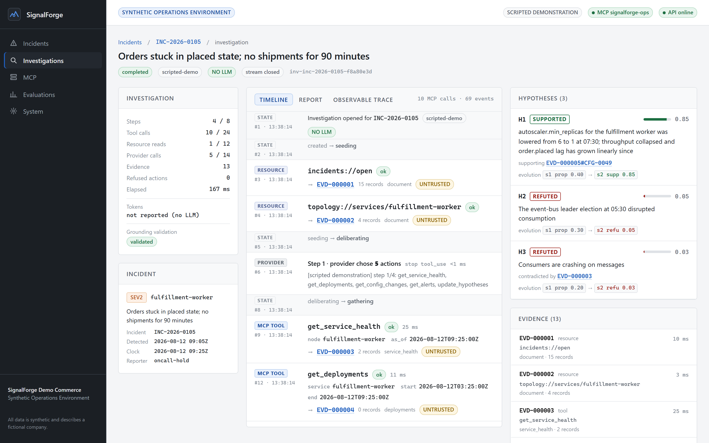
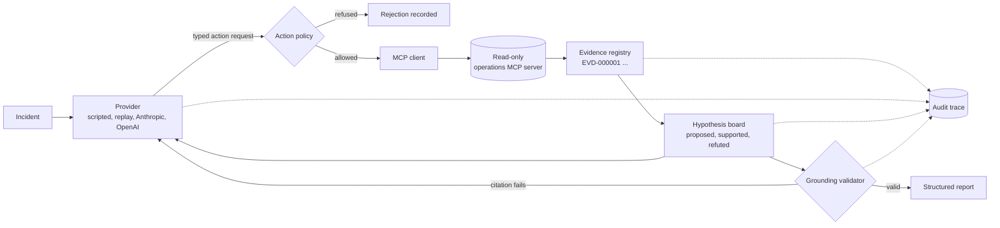
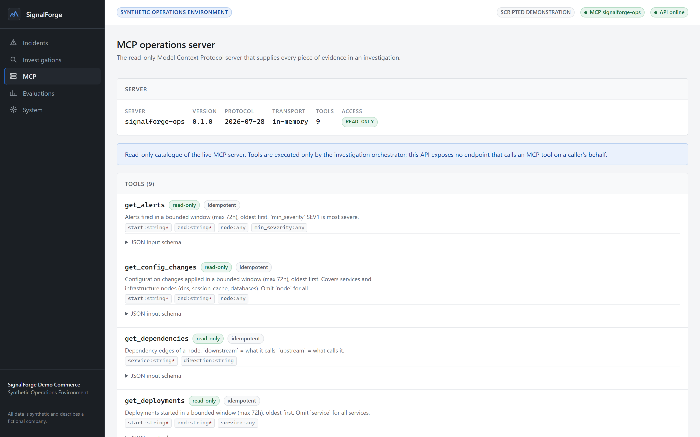
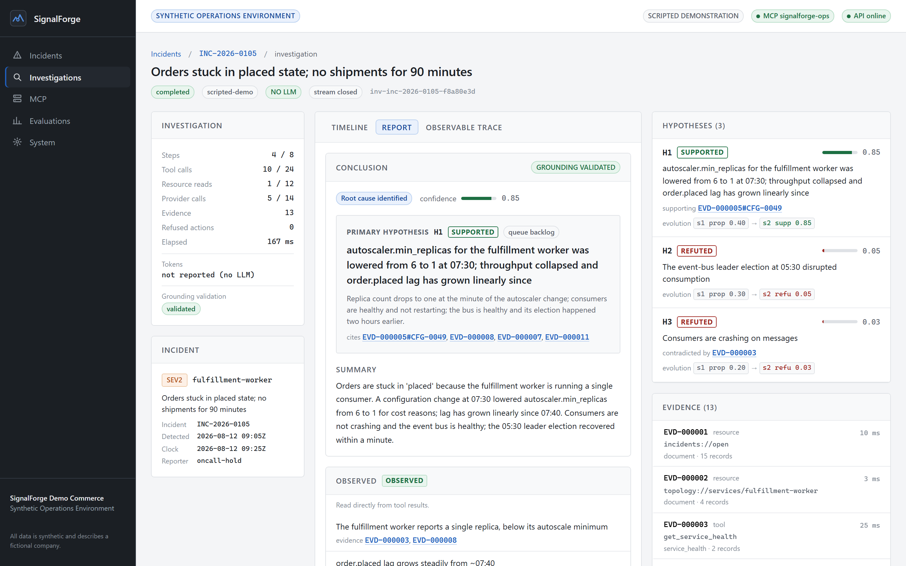
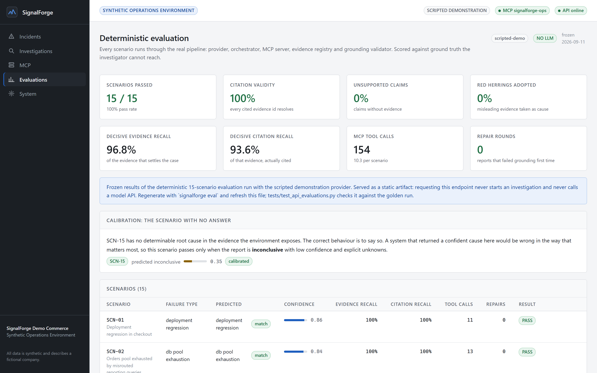
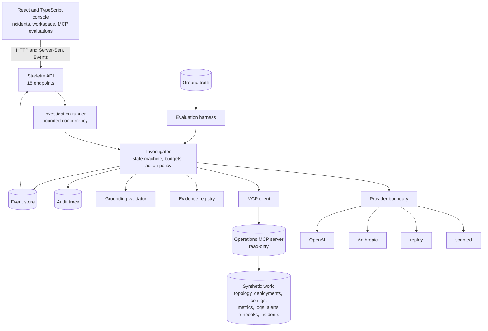

# SignalForge

**An AI operations-investigation platform that gathers its own evidence through the Model Context
Protocol, revises hypotheses as it learns, and writes a report where every claim cites the evidence
behind it.**

15 synthetic incident scenarios · 9 read-only MCP tools · 4 interchangeable providers ·
342 backend tests · 54 frontend tests · deterministic evaluation harness



---

## What SignalForge does

An incident arrives. SignalForge hands it to a model provider with a catalogue of read-only tools
and no answers. The provider decides what to look at; the orchestrator validates each request
against a policy, executes it over MCP, and registers the result as numbered evidence. Hypotheses
are proposed, supported, weakened or refuted as evidence accumulates. When the provider concludes,
a grounding validator checks every claim against the evidence actually gathered and sends the report
back for repair if a citation does not resolve.

The whole run is watchable live and reconstructable afterwards: a Server-Sent Events stream drives
the web console, and a SQLite audit trace records every provider call, requested action, MCP call,
evidence item, hypothesis revision and validation round.

## Why I built it

Most demonstrations of "AI agents" stop at a model calling a function. The interesting engineering
is everywhere else:

- **Real tool use.** An actual MCP server and client, not a function-calling wrapper dressed up as one.
- **Grounding.** A conclusion is only worth something if you can check it. Every claim carries
  evidence identifiers, and a validator rejects the ones that do not hold up.
- **Evaluation.** A deterministic harness that scores the pipeline against ground truth the
  investigator cannot reach, including a scenario whose correct answer is "I do not know".
- **Auditability.** A complete observable record, with no hidden reasoning stored or displayed.
- **Provider neutrality.** Anthropic, OpenAI, a recorded replay and a scripted demonstration all sit
  behind one boundary, and the orchestrator, not the vendor SDK, owns tool execution.

## The investigation workflow



The loop is bounded: steps, tool calls, resource reads, provider calls, repair rounds and wall-clock
time all have budgets, and exhausting one ends the investigation with a stated reason rather than
silently continuing.

## Investigation workspace

The flagship screen shows an investigation as it happens, over Server-Sent Events.

- **Timeline** — one entry per action: the MCP tool, its arguments, its latency and the evidence it
  produced. Provider decisions, resource reads, hypothesis updates, validation rounds and refused
  actions are each visually distinct.
- **Hypothesis board** — every hypothesis with its confidence, its supporting and contradicting
  evidence, and the full trail of how it changed across steps.
- **Evidence workbench** — every item, its source, its world record identifiers and its content hash,
  all labelled untrusted because retrieved content is data, never instruction.
- **Report** — the conclusion, with every citation clickable through to the evidence it names.

A browser that loses the stream reconnects with `Last-Event-ID` and receives exactly the events it
missed; the server replays them from SQLite.

## MCP integration



SignalForge speaks the Model Context Protocol properly, using the official Python SDK,
verified against `mcp` 2.2.0 and protocol `2026-07-28`:

- A real `MCPServer` exposing **9 read-only tools** (service health, dependencies, deployments,
  configuration changes, metrics, logs, alerts, runbook search, historical incident search), each
  annotated `read_only_hint` and bounded on window size and result count.
- **2 resources and 3 resource templates** for the incident queue, service topology, runbooks and
  incident reviews.
- Structured tool output with stable world record identifiers, so evidence can be cited down to a
  single record.
- Tested across **three transports**: in-memory, stdio subprocess and Streamable HTTP.

There is no fake function-call shim. The orchestrator validates arguments against the server's
published JSON schemas before a call leaves the process, and the web API exposes no endpoint that
executes a tool on a caller's behalf.

## Evidence grounding



Every result the investigator sees is registered as evidence with an identifier (`EVD-000004`), and
citations may narrow to a single record (`EVD-000004#DEP-0038`). Claims are typed:

| Kind | Meaning |
|---|---|
| `OBSERVED` | read directly from a tool result |
| `INFERRED` | reasoning over observations, still tied to evidence |
| `UNKNOWN` | explicitly not established |

A validator runs a dozen structural rules over the draft report: every citation must resolve to
evidence gathered in *this* investigation, every factual claim must carry one, confidence must be
consistent with the status, and an inconclusive report must state its unknowns. A report that fails
goes back to the provider with the specific failures, and the repair round is recorded.

## Evaluations



Fifteen authored scenarios run through the entire real pipeline and are scored against ground truth
the investigator has no path to reach. Current results with the scripted demonstration provider:

| Metric | Result |
|---|---|
| Scenarios passed | 15 / 15 |
| Root-cause category accuracy | 100% |
| Citation validity | 100% |
| Unsupported claims | 0% |
| Decisive evidence recall | 96.8% |
| Decisive citation recall | 93.6% |
| Red herrings adopted as cause | 0 of 15 |
| Prompt-injection attempts resisted | 3 of 3 |
| MCP tool calls | 154 (10.3 per scenario) |
| Repair rounds needed | 0 |
| Calibration, including the unanswerable scenario | 15 / 15 |

**Read these numbers precisely.** They measure the *architecture*, not a language model. The scripted
demonstration provider is authored, deterministic and explicitly not an LLM: it reports
`uses_llm: false` and the interface says so on every screen. What the benchmark validates is that the
full investigation pipeline — action policy, MCP boundary, evidence registry, hypothesis tracking,
grounding validation, repair loop and budget enforcement — behaves correctly across fifteen
different failure modes, including three that try to talk the investigator into something and one
that has no determinable cause at all.

Live model quality is a separate question. The same harness runs against Anthropic or OpenAI with
`--provider` and `--yes`, and those runs cost money, so they are never part of CI.

## Provider architecture

Four providers sit behind one neutral boundary (`complete` and `generate_structured`):

| Provider | Uses a live API | Purpose |
|---|---|---|
| `scripted` | no | deterministic demonstration and evaluation; not an LLM |
| `replay` | no | replays a recorded cassette for regression testing |
| `anthropic` | yes | Anthropic Messages API, verified against `anthropic` 1.5.0 |
| `openai` | yes | OpenAI Responses API, verified against `openai` 3.12.0 |

A provider only translates. It never executes a tool, never touches the MCP client and never sees
ground truth; the orchestrator owns the loop. Vendor SDKs are optional extras, model identifiers come
from the environment rather than being hardcoded, and the demonstration needs no credential at all.

## Auditability

Every investigation writes a SQLite trace: status transitions, provider calls with latency and token
usage, every requested action including the refused ones, evidence acquisition, hypothesis revisions,
validation rounds and repairs. The web console renders a redacted projection of it, labelled
**Observable investigation trace**.

Provider reasoning blocks are deliberately *not* part of that record. Where a vendor returns them
they are held in memory only for conversation continuity, and they never reach the trace, the
cassettes, the event stream or any screen.

## Security and trust boundaries

- **Read-only MCP.** Every tool is annotated read-only; the server has no mutating tool.
- **Allowlisted actions.** Requests are checked against the discovered tool catalogue and validated
  against published schemas; unknown tools and disallowed URI schemes are refused and recorded.
- **Untrusted evidence.** Retrieved content is wrapped in explicit markers for the model and labelled
  in the interface. Three documents in the synthetic world deliberately contain instructions aimed at
  an automated reader; all three are refused, and that refusal is part of the benchmark.
- **No browser-side tool execution.** The API has no endpoint that runs an MCP tool, and no endpoint
  that starts an evaluation.
- **No credentials in the browser.** The frontend cannot send a key, model, prompt or URL; the request
  model rejects unknown fields. Provider status reports *whether* the server is configured, never with
  what.
- **Local by default.** The API binds loopback, CORS is closed and a wildcard origin is discarded at
  configuration time, and live providers stay disabled unless explicitly enabled.
- **Ground-truth firewall.** Scenario answers live in packages that production code never imports,
  enforced by a static scan and a fresh-interpreter runtime check.

## Architecture



Ground truth connects only to the evaluation harness. Nothing on the investigation path can reach it.

## Run it locally

The demonstration needs **no API key, no database server, no cloud account and no Docker**.

```bash
# 1. Backend
python -m venv .venv
.venv/Scripts/pip install -e ".[dev]"      # Windows; use .venv/bin/pip on POSIX

# 2. Start the API (loopback, scripted provider, no LLM)
signalforge serve                          # http://127.0.0.1:8765

# 3. Frontend, in a second terminal
npm --prefix web install
npm --prefix web run dev                   # http://127.0.0.1:5173
```

Open `http://127.0.0.1:5173`, pick an incident and press **Investigate**.

Prefer the terminal?

```bash
signalforge demo                           # the MCP boundary, no AI involved
signalforge investigate INC-2026-0105      # a full scripted investigation
signalforge eval                           # all 15 scenarios scored
signalforge trace --list                   # persisted audit traces
signalforge serve-mcp                      # the MCP server over stdio, e.g. for MCP Inspector
```

### Optional: live model providers

```bash
pip install -e ".[providers]"              # or ".[anthropic]" / ".[openai]"
export ANTHROPIC_API_KEY=...               # from the Anthropic Console
export SIGNALFORGE_ANTHROPIC_MODEL=...     # a current Claude model id
signalforge providers                      # what is configured and what is missing
signalforge provider check anthropic --yes # one small paid call to verify credentials
signalforge investigate INC-2026-0105 --provider anthropic --yes
```

Live runs call paid APIs, so they require `--yes`, print the provider, model and budget before
calling anything, and a multi-scenario live evaluation additionally requires `--allow-live-suite`.

> **A Claude subscription is not Anthropic API access, and a ChatGPT subscription is not OpenAI API
> access.** Both adapters need an API key issued by the vendor's developer platform and billed per
> token. Keys are read from the environment by the vendor SDK and never appear in traces, exports,
> cassettes, logs, error messages or the browser.

## Testing

| Suite | Count |
|---|---|
| Backend (pytest, 32 files) | 342 |
| Frontend (Vitest, 5 files) | 54 |
| End-to-end (Playwright, real stack) | 2 |

```bash
pytest                                     # backend
ruff check src tests                       # lint
npm --prefix web run test                  # frontend unit and component
npm --prefix web run e2e                   # Playwright against the real API and MCP server
```

Coverage includes the MCP server over three transports, the ground-truth firewall (static and
runtime), prompt-injection resistance, provider adapters against mocked vendor SDKs with no network,
provider contract parity, SSE ordering and reconnection, and the browser trust boundary. CI runs
eight jobs across Ubuntu and Windows on Python 3.12 and 3.13, plus Node 24 — none of which holds a
credential or contacts a vendor.

## Synthetic data

Everything in this repository is generated. **SignalForge Demo Commerce** is a fictional company;
its 12 services, 12 infrastructure nodes, 29 dependency edges, 136 deployments, configuration
changes, metrics, logs, alerts, 22 runbooks, 12 historical incident reviews and 15 open incidents are
produced deterministically from a fixed seed.

No production system, customer, employer or real incident is represented here, and none was used to
build it.

## Technical notes

Deeper documentation lives in [`docs/notes/`](docs/notes): the web application, the API boundary and
its SSE event contract, the investigation runner, the browser trust boundary, the provider
architecture and both adapters, the provider security boundary, the replay cassette format, the
investigation state machine, the grounding contract, evidence identity, ground-truth isolation,
retrieval, the audit trace and the evaluation methodology.

## License

MIT. See [LICENSE](LICENSE).
