# Investigation state machine

`signalforge.orchestration` runs one bounded investigation. State is a typed
`InvestigationState`; every status change goes through `transition()`, which
rejects illegal edges and appends to `history`. There is no hidden mutable state
and no unbounded loop: every iteration consumes budget.

```mermaid
stateDiagram-v2
  [*] --> created
  created --> seeding
  seeding --> deliberating: tools listed; incidents://open and topology read as seed evidence
  deliberating --> gathering: provider requested actions
  deliberating --> concluding: no actions, finish_investigation, or budget exhausted
  gathering --> deliberating
  gathering --> concluding: finish requested
  concluding --> validating: ReportDraft produced
  validating --> completed: no errors, no warnings
  validating --> completed_with_warnings: warnings only
  validating --> repairing: errors and repair rounds remain
  repairing --> validating
  validating --> failed_validation: errors after the last repair
  created --> failed
  seeding --> failed
  deliberating --> failed
  gathering --> failed
  concluding --> failed
  validating --> failed
  repairing --> failed
```

## One step

1. **Budget gate.** `deliberation_exhausted()` checks steps, tool calls, wall clock and model calls
   (calls for the report and its repairs are reserved). Any exhausted dimension ends deliberation with
   an explicit `termination_reason`; the report is still requested.
2. **Provider turn.** `provider.complete(system, conversation, tools=MCP tools + local actions)`.
   Provider failures are retried once; timeouts use `anyio.fail_after`.
3. **Policy review.** Each `ToolRequest` becomes exactly one typed action or an `ActionRejection`
   (`unknown_action`, `invalid_arguments` against the MCP input schema, `tool_not_allowed`,
   `uri_not_allowed`, `duplicate_call`, `limit_exceeded`, `budget_exhausted`).
4. **Execution.** `CallTool` -> `OpsClient.gather` (registers evidence); `ReadResource` ->
   `read_as_evidence`; `UpdateHypotheses` -> `HypothesisBoard.apply_all` (evidence ids validated
   against the registry); `FinishInvestigation` -> sets the finish flag. Rejections return an error
   result to the provider and are recorded in the trace; nothing rejected reaches MCP.
5. **Results** are rendered back to the provider with a machine-readable header
   (`evidence_id`, `source_ids`, `resource_uris`) and a truncated payload; the registry keeps everything.

## Actions

| Action | Arguments | Effect |
|---|---|---|
| any MCP tool | validated against the tool's published `inputSchema` | one MCP call, one `EVD` item |
| `read_resource` | `uri` with an allowed scheme (`catalog`, `incidents`, `topology`, `runbook`, `incident`) | one resource read, one `EVD` item |
| `update_hypotheses` | list of `HypothesisUpdate` (ref/id, statement, confidence 0..1, status, evidence ids) | board update; assigned ids echoed back |
| `finish_investigation` | `reason` | ends deliberation |

Natural language is never executable: a request whose name is not a catalogued tool or local action is
rejected as `unknown_action`.

## Budget (`InvestigationBudget`)

`max_steps` 8 · `max_tool_calls` 24 · `max_resource_reads` 12 · `max_actions_per_step` 8 · `max_model_calls` 14
(of which `1 + max_repair_rounds` are reserved for reporting) · `max_repair_rounds` 1 ·
`max_wall_clock_seconds` 180 · `max_evidence_chars_per_result` 6000. Usage is tracked in `BudgetUsage`
and persisted with the trace.

## Hypotheses

`HypothesisBoard` assigns `H1, H2, ...`, keeps `created_step`/`updated_step`, and appends a
`HypothesisRevision` for every update so the evolution (not only the final answer) is preserved and
rendered by the CLI and the trace. Updates that cite unknown or foreign evidence are rejected whole.
